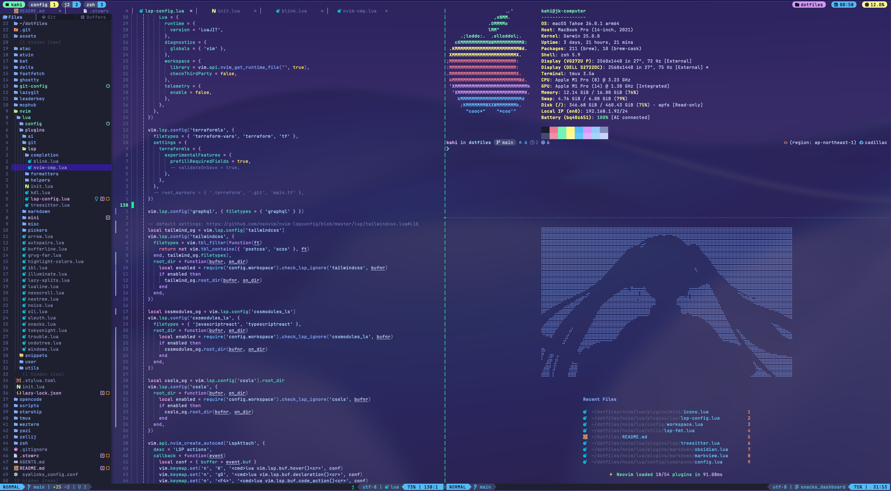

# Dotfiles

## Initial Setup

setup requires 2 main steps 
1. uses `stow` to symlink all config files to `~/.config` directory  
2. uses a custom `symlink` script to symlink files like `.zshrc` to the home directory

### use stow to symlink all config files to `~/.config` directories

```bash
stow .
```

### symlinks script

this script is mainly for symlinking `.zshrc`/`.zshenv` config files to symlink is defined in [symlink conf](./symlinks_config.conf)
stow only symlinks files to `~/.config` but zsh config is required in the home directory

#### Install

```bash
chmod +x ./scripts/symlinks.sh
./scripts/symlinks.sh --create
```

#### Unlink

```bash
./scripts/symlinks.sh --delete
```

### tmux catpuccin (manual installation)
- tpm version is not working properly

```bash
git clone -b v1.0.1 https://github.com/catppuccin/tmux.git ~/.config/tmux/plugins/catppuccin/tmux
```


## Global Gitignore Setup 

### global gitignore

requires stow to be run first to create the `.config/git-config` directory

```bash
git config --global core.excludesfile ~/.config/git-config/.gitignore_global
```

## Misc

### Custom Theme

a custom theme based on [tokyonight moon](https://github.com/folke/tokyonight.nvim) and [prometheux-ar/cyberpunk](https://github.com/prometheux-ar/cyberpunk) theme




## 🙏 Acknowledgments

- custom symlink script from [hedrikmi]("https://github.com/hendrikmi/dotfiles/tree/main")
- theme Inspired by [tokyonight moon](https://github.com/folke/tokyonight.nvim) and [prometheux-ar/cyberpunk](https://github.com/prometheux-ar/cyberpunk).
